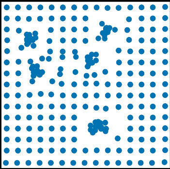

# LodeSTAR Functionality and Analysis

## What is LodeSTAR?
LodeSTAR (Low-shot deep Symmetric Tracking And Regression) is a deep-learning model for particle tracking on microscopy which is especially useful in noisy images. Unlike traditional methods, LodeStar only needs one unlabeled image for training due to its self-supervised approach, which leverages inherent symmetries in particle movement. The input image can be any resolution. However, it is important to note that only ONE particle can be present inside the immage. We cannot have multiple instances of the same or different particles in the image.

## Why create LodeSTAR?
LodeSTAR was created due to existing challenges in particle tracking. These challenges are as follows:
- Data Requirements: Traditional deep-learning models for particle tracking generally rely on large labelled datasets which are hard to create for particles, especially when the particles are tiny, densely packed or overlapping.
- Annotating Issues: Labelling particles in very challenging as it often requires sub-pixel accuracy which is hard to achieve manually. Additionally, annotating manually is labour extensive and expensive.
- Realism in Data: Most datasets are synthetic, which may not replicate the exact characteristics of particles in a real-world environment.

LodeSTAR addresses these issues by creating a new apporach that doesn't require large labelled datasets. Instead, it uses symmetry and self-supervised learning to find particle positions accurately.

## How is symmetry useful?
Symmetry in this context refers to how particles look when they're rotated, translated or reflected. For example, if we rotate a circular particle, the particle still looks circular and its center will be the same relative to all the points on its circumference. The model learns that if it shifts or rotates the input particle, the expected output should also shift or rotate in the same way. This is called 'equivariance.' Equivariance is helpful in training the model because it lets the model learn from transformations of the same image, rather than needing many labeled examples. By applying transformations (like shifts or rotations) and expecting the prediction to move in the same way, the model can learn consistent tracking without needing an exact ground truth for each transformed version. This reduces the need for a large labeled dataset and helps the model generalize better.

## How does LodeSTAR work?
We start with a single unlabelled image and feed it to the model.

The model applies a lot of different KNOWN transformations to the input image to generate more training data.

Since the model knows what transformation was applied to the input image, it can mathematically derive where the position of the particle in the transformed image should be. For example, if the original image had the particle at positon (x, y) and the image was shifted to the right by 5 pixels, then the particle in the transformed image would be at position (x+5, y). This derived position is used as a pseudo-label by LodeStar.

The transformed image is then fed into LodeStar's CNN, which is supposed to be translation invariant. The pseudo-label is used by the CNN as a guide to predict the location of the particle in the transformed image.

The CNN returns three things: Δ𝑥, Δ𝑦, and 𝜌 where (Δ𝑥, Δ𝑦) are vectors that estimate the distance from each pixel to the particle and 𝜌 is the normalized weight map. Each entry on this weight map is the probability that this pixel belongs to the particle.

LodeStar uses (Δ𝑥, Δ𝑦) to generate ***predicted absolute coordinates of the particle's position*** in the image using the following equations:
- $x_{i,j}​ = Δx+i⋅k−(N/2k)​$
- $y_{i,j} = Δy+j⋅k−(M/2k)$

where N is the size of the input along the first dimension, and M is the size of the tensor along the second dimension, and k is a scale factor relating the size of the input to the output (k = 2 for the proposed architecture).

Essentially, this will generate another map that can help us get an idea of where the particle really might be.

### This is ONLY for tracking a single particle
Then, we generate a weighted average of the *predicted absolute coordinates* to get the position of the particle in the transformed image.

### For multiple particles
We skip generating the weighted average. Instead, we multiply the weight map with the predicted coordinates. This results in a map that looks like:

Here, LodeSTAR highlights areas with the highest chance of containing particles. Then, we look for local maxima which indicate particle positions. Finally, instead of averaging over the entire map, LodeSTAR averages over small regions around each detected particle, which gives us the precise positions for each one.

Lastly, we back-transform these coordinates into the original image we fed the model using the inverse of the applied transformation (we can do that because we know the transformation applied in the first place) and compare this position with the actual position of the particle in the original image. The difference between the two is the "loss" we need to mitigate.

The loss functions for the x-coordinate and y-coordinate are defined as follows:

### X-Coordinate Loss

$L^x_{i,j} = | x_{i,j} - ∑ x * w | w_{i,j}$

### Y-Coordinate Loss

$L^y_{i,j} = | y_{i,j} - ∑ y * w | w_{i,j}$

where:

- `x_{i,j}`: Predicted x-coordinate of the particle’s position for pixel `(i, j)`.
- `y_{i,j}`: Predicted y-coordinate of the particle’s position for pixel `(i, j)`.
- `w_{i,j}`: Weight value from the weight map for pixel `(i, j)`, representing the confidence or probability that this pixel is near the particle.
- `∑ (x * w_{i,j})`: Weighted average of all x-coordinate predictions, using the weight map.
- `∑ (y * w_{i,j})`: Weighted average of all y-coordinate predictions, using the weight map.

## Model Architecture
- Initial Convolational Layers:
  - Three 3x3 Convolutional Layers with 32 filters and ReLU activation functions
  - These layers extract basic features from the image, like edges and textures, which are essential for identifying the particle.
- Max-Pooling Layer:
  - After the first three convolutional layers, there is a 2x2 max-pooling layer.
  - This layer reduces the spatial dimensions by half, allowing the network to focus on larger-scale features in subsequent layers.
- Additional Convolutional Layers:
  - Eight more 3x3 Convolutional Layers with 32 filters each and ReLU activation.
  - These layers refine the feature extraction process, building a more complex representation of the particle that incorporates spatial relationships across the entire image.
- Final Convolutional Layer:
  - One 1x1 Convolutional Layer with 3 output channels and no activation function.
  - This layer produces three output channels: Δ𝑥, Δ𝑦, and 𝜌.

## Problems with LodeSTAR (These are theoretical)
- Tracking Extended or Continuous Structures:
  - LodeSTAR is designed to track small, localized particles, not long or continuous structures. For example, it would struggle to track a squiggly line or an elongated shape like a microscopic worm because these shapes lack a single, fixed center and change their shape across frames.
- Tracking particles of Different Shapes in the Same Image:
  - Since LodeSTAR learns from a single particle’s features, it’s specialized for tracking particles with similar shapes and characteristics. In an image with multiple particles of distinct, different shapes, LodeSTAR would likely misinterpret or fail to track all shapes accurately.
- Tracking complex and non-rigid movements:
  - LodeSTAR assumes that transformations (like rotation and translation) maintain the particle’s appearance. For objects that deform significantly or change shape (like microscopic worms or cells with flexible bodies), this assumption breaks down, and LodeSTAR’s symmetry-based approach would struggle to follow them.
- Accurately Tracking Complex Overlapping Structures:
  - Although LodeSTAR handles some degree of overlapping particles well, highly complex or continuous overlaps (like clusters of elongated shapes) would make it difficult for LodeSTAR to isolate each particle. In such cases, it might jump between overlapping particles or lose track entirely.
